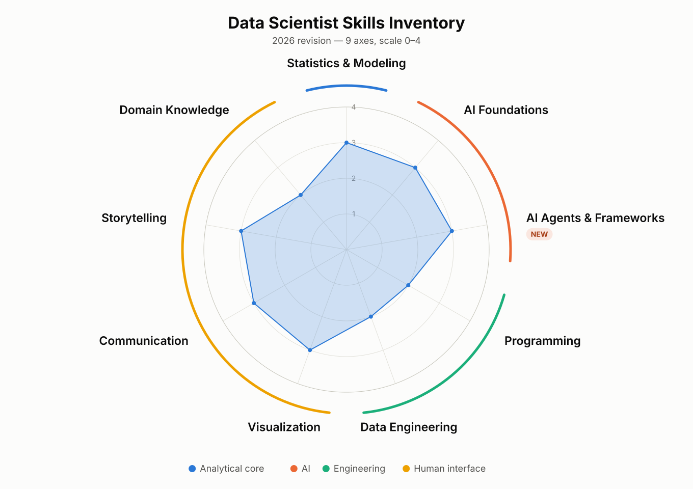

# Data Scientist Skills Inventory — 2026 Revision

A refreshed skills inventory for data scientists, updating the *Data Science in
Practice* framework for the era of generative AI and AI agents — plus an
interactive radar-chart explorer for plotting individual and team profiles.

**▶ [Open the interactive explorer](https://vanderbilt-data-science.github.io/ds-skills-inventory/ds-skills-explorer.html)** — set nine sliders, load an archetype, overlay a comparison, export SVG or PNG.



## Where this comes from

The inventory is the companion to a data science **maturity model** that has
been in use since 2012 — a way of describing organizations, not people:

| Stage | The organization |
|---|---|
| **1** | Little built out. Some analysis, retrospective dashboards, key driver analysis. Data barely used. |
| **2** | Localized analytics — a few pockets doing genuinely good work, usually wherever a data scientist quietly landed. |
| **3** | Enough infrastructure and enough people to *build* solutions. A handful of shipped data science / ML products, each one hard-won. |
| **4** | Defined by its analytics. Many products, responds fast, outmaneuvers competitors. Still rare. |
| **5** | Analytical competitor — analytics *is* the business model, not an advantage layered on top of it. Rarest of all. |

The classic Stage 5 illustration is a package delivery company whose real
product looks like trucks and boxes, but whose margin comes from a routing
algorithm that maximizes right-hand turns — because at a red light you may turn
right, and you may never turn left, so every left turn is an idling engine, a
paid driver going nowhere, and fuel burned for nothing.

The stages set the demand; this inventory describes the supply. Which skills a
data scientist needs has always depended on which stage they are working in —
and which stage suits them.

## What changed

**The ceiling on a single person moved.** Reaching Stage 3 used to require
infrastructure and a team. One well-trained data scientist can now carry an
organization from Stage 1 to Stage 3, and depending on the organization,
sometimes into Stage 4 — building the infrastructure they need along the way
rather than waiting for it. Infrastructure still eventually bites, and getting
to Stage 4 and 5 still takes engineering that isn't done by one person. But the
range of a single well-equipped individual is far wider than it was.

**The unicorn advice inverted.** The old counsel to organizations was: *don't*
hire the generalist who can do everything. They were extraordinarily expensive,
they could still only do one or two things at a time, and you were better served
by a team of specialists. The current counsel is the opposite — hire that
person, because the constraint that made them a poor deal (one human, one task
at a time) is the constraint that has lifted.

**The panic was aimed at the wrong thing.** When AI became fluent at code and
SQL, many data scientists panicked, because they believed those skills were what
made them data scientists. They aren't — they define a programmer or a data
analyst. What defines the work is bringing all of the skills together to solve a
problem with data and theory. The commoditized skills got compressed; the
integrative ones became the differentiator.

That reasoning drives the specific changes to the wheel:

| Change | Detail |
|---|---|
| **Machine Learning / Deep Learning → AI Foundations** | Value has moved from building networks to understanding how models work well enough to make good decisions with them, and to *adapting* them — prompting, retrieval, fine-tuning, distillation. You cannot make sound calls about a tool you don't understand. |
| **New axis: AI Agents & Frameworks** | Working *through* AI rather than merely on it. The biggest multiplier on the wheel — it raises effective capacity on every other axis. |
| **SQL & data access → folded into Data Engineering** | Describe what you want and AI writes the query, at least as well as most people would. Standalone SQL fluency no longer justifies its own spoke. |
| **Evaluation and ethics → rungs, not spokes** | When AI produces the code and the prose, verification becomes the core technical act — so it is baked into the 0–4 ladders of both AI axes rather than sitting beside them. |
| **Programming de-emphasized, not deleted** | See below — this one deserves its own explanation. |
| **"Big data" retired** | An outdated term for what is now simply Data Engineering. |

## The nine axes

| Cluster | Axes |
|---|---|
| Analytical core | Statistics & Modeling |
| AI | AI Foundations *(absorbs ML/DL)* · **AI Agents & Frameworks** *(new)* |
| Engineering | Programming · Data Engineering *(absorbs SQL & data access)* |
| Human interface | Visualization · Communication · Storytelling · Domain Knowledge |

Human interface intentionally carries the most axes: it is where data scientists
differentiate as AI compresses the technical floor.

Every axis is scored **0–4**, from coursework-only to frontier-advancing. The
reasoning behind the changed axes is in
[`skills-assessment.md`](skills-assessment.md); the rung-by-rung rating rubric
for all nine — with evidence anchors, calibration rules, and the self-assessment
procedure — is in [`skill-level-rubric.md`](skill-level-rubric.md).

### Notes on the axes that moved

**Statistics & Modeling** is not just inferential statistics. It is frequentist
*and* Bayesian, at the level where you can actually employ it — the ability to
build the model that holds everything else equal, so you can answer whether the
campaign worked once seasonality and the acquisition are factored out. A
Bayesian viewpoint also turns out to be one of the best ways to make sense of
both AI models and machine learning models, which is why it repays going deep.

**Programming is at a pivot point** — a teeter-totter you're standing in the
middle of. Look back far enough and programming meant flipping switches to enter
op codes by hand, and the job skills were good perception and a memory for
octal. Then assembly, then compilers, then Python. Nobody today verifies that
their compiler emitted the right op codes; for years, people did. Every one of
those eras kept the same core act: *thinking about how to solve the problem, and
knowing when the answer is correct.* Working with agents is the next rung on
that abstraction ladder, not the end of the ladder. Right now the board is
balanced and you need both sides — some employers will still ask you to write it
by hand, and reading code well is what lets you catch what the agent got wrong.

**Data Engineering after "garbage in, garbage out."** That rule was close to
literal for classical machine learning: no clean structured data, no model, and
plenty of organizations stalled there for years. It no longer holds the same
way — unstructured and even dirty data can now be put to useful work. Data
engineering didn't shrink, it forked: you now do it both for machine learning
solutions and, differently, for AI solutions.

**AI Agents & Frameworks is the axis that never finishes.** The frameworks will
keep turning over, so this is the one spoke that requires deliberate,
continuous refresh rather than a course you complete. Two ideas anchor it:

- *Chat versus agent.* Chat is "write me a query" — here you go, good luck.
  An agent writes the query, runs it against real data, checks it against an
  expectation you supplied ("this join should return 238 records"), localizes
  the fault when the count is wrong, and records what it learned about the data
  back into the metadata. The difference is verification in the loop.
- *Skills as the unit of expertise.* Your knowledge of a specific data store —
  its metadata, its soft spots, the field everyone calls an index that isn't
  actually unique, the query patterns you always reach for — can be encoded as
  an agent skill: your expertise, made available to the model, reusable by you
  and shareable with your team. Increasingly the deliverable is not just the
  analysis, but the analysis *plus the skills used to produce it.*

None of this absolves anyone of the other axes. If you don't understand the
query, you will never notice that it's wrong. AI-written work is usually close;
the data scientist's job is knowing how much confidence to place in it, which is
exactly why the differentiating axes are the ones AI didn't flatten.

## Reading a profile

Two things make the shape informative rather than decorative.

**Some axes now rise fast; others are still won the slow way.** Programming,
Data Engineering, and AI Agents & Frameworks climb quickly once you're working
with agents seriously — visibly, within weeks. Statistics & Modeling,
Visualization, Communication, Storytelling, and Domain Knowledge are the last
mile: they come from study, from practice, and from doing real projects with
real audiences. So a profile isn't only a picture of where you are — read
against that grain, it tells you where the remaining work actually is, and it is
usually not where people expect.

**Preference matters as much as capability.** The archetypes below are partly
about what you *enjoy*, and you generally won't discover that until you've
carried real projects. One example worth knowing in advance: a data engineering
deliverable can be *finished* — the pipeline runs, the boxes are checked. A pure
data science or AI solution never can be. There is always another increment of
performance you could have chased, and you always stop before perfect. Some
people find that genuinely uncomfortable, and drift toward the engineering side
of the wheel. That's a legitimate discovery about fit, not a failure.

## The archetypes

Six presets ship with the explorer:

| Preset | Shape |
|---|---|
| **The Guide** (Stage 1) | Human interface–heavy — storytelling, communication, visualization — now needing AI Agents nearly as much. Thrives on understanding what someone needs and building it for them. |
| **The Builder** (Stage 2–3) | Data Engineering plus the verification rungs of AI Foundations. Team-oriented; at home in GitHub Flow. |
| **The Architect** (Stage 3–4) | The engineering axes plus governance as adoption scales company-wide — which is also where IT and security become collaborators, not obstacles. |
| **The Visionary** (Stage 4–5) | Lives at the top of both AI axes. The person who wants to build what nobody has built yet. |
| **The Toolmaker** | AI-axes specialist who equips 10× analysts. |
| **Balanced 2026 DS** | The default well-rounded profile. |

## Using it for self-assessment

There are two ways in. For a **quick live pass**, the explorer is built to be
driven in a classroom, a one-on-one, or a team planning session. For a
**defensible score you can act on**, use
[`skill-level-rubric.md`](skill-level-rubric.md) — behaviorally anchored rungs
for all nine axes, an artifact rule that keeps the numbers honest, the
verification cap on Programming, the currency-decay rule on AI Agents, and a
portrait template to keep alongside your exported chart.

For the quick pass: walk the nine sliders one at a time, ask an honest question
per axis, and set the value:

> *Statistics:* one course, two, or beyond into Bayesian? · *AI Foundations:*
> could you explain a transformer to someone? · *Agents:* are you actually
> delegating real work? · *Programming:* how many languages, and were you the
> one people brought their bugs to? · *Data Engineering:* have you ever gotten
> data all the way to a dashboard yourself? · *Visualization:* have you built
> something genuinely compelling for a real problem? · *Communication:* could
> you stand up in front of executives and defend it? · *Storytelling:* could you
> explain something complex to a non-technical audience as a story? · *Domain:*
> is there a field you actually know?

Then keep the file. It's a single self-contained HTML page, so you can save your
own copy, put your name on it, and re-run the assessment later to see the shape
change.

**An exercise, if you want one.** The explorer deliberately has no backend.
Take it and build one: record each self-assessment with a timestamp, then play
your profile back as a movie over the course of a program. Point an agent at
this repo and build it the way *you* want it — which is, appropriately, an
exercise on the axis this revision added.

## What's in the repo

| File | What it is |
|---|---|
| [`ds-skills-explorer.html`](ds-skills-explorer.html) | **Interactive explorer.** Single self-contained file — no build, no dependencies. |
| [`career-comparison.html`](career-comparison.html) | **Career comparison.** Your profile against the ten most common data-science careers; click a career to darken its line and shade its area. Career values are illustrative estimates, not part of the rubric. |
| [`ds-skills-radar.svg`](ds-skills-radar.svg) | Standalone vector radar of the sample profile, hand-editable, sized for projection. |
| [`make_svg.py`](make_svg.py) | Generator for the SVG. Skills, values, and clusters are a plain Python list at the top. Standard library only. |
| [`skills-assessment.md`](skills-assessment.md) | The taxonomy: what changed and why, the 0–4 rung ladders, implications for the archetypes, and what was considered and set aside. |
| [`skill-level-rubric.md`](skill-level-rubric.md) | **The rating rubric.** Behaviorally anchored 0–4 ladders for all nine axes, calibration rules, and the procedure for turning nine numbers into a portrait. |
| [`vis-design-rationale.md`](vis-design-rationale.md) | Why the visualization looks and behaves the way it does — including an honest accounting of radar charts' weaknesses and how each is managed. |

## Using the explorer

Open the [live version](https://vanderbilt-data-science.github.io/ds-skills-inventory/ds-skills-explorer.html),
or download `ds-skills-explorer.html` and open it locally — it's one file with no
dependencies, so it works offline and off a USB stick.

- **Sliders are the input, the radar is the output.** Nine sliders, 0–4 in 0.5
  steps, grouped under the same cluster headings as the chart, with the numeric
  value always visible — you never have to decode the chart to read a value.
- **Presets** load any archetype in one click. Touching a slider flips the
  selector to "Custom", so a preset never silently misdescribes what's shown.
- **Comparison** overlays a second profile as a dashed, unfilled polygon — your
  team today against what the next stage would require.
- **Export** downloads the current chart as SVG (vector, editable) or PNG
  (paste into slides), and "Copy values" gives you the raw numbers.
- **Light and dark** are both hand-tuned; the chart follows your OS theme.

## Editing the graphics

The SVG is meant to be modified. Either edit it directly — it ships with named
groups (`rings`, `axes`, `cluster-arcs`, `profile`, `labels`, `new-badges`), a
how-to-edit comment block, and per-axis comments — or change the data and
regenerate:

```bash
python3 make_svg.py     # stdlib only; writes ds-skills-radar.svg next to the script
```

Edit the `SKILLS` and `CLUSTERS` lists at the top of `make_svg.py` to change
axes, values, or cluster colors. The explorer mirrors this: its `SKILLS` and
`PRESETS` arrays are the single place axes and archetypes are defined, and
everything else derives from them.

## Design notes worth knowing

Radar charts are a weak general-purpose form — areas mislead, axis order is
arbitrary, and comparing many shapes gets muddy. They earn their keep in one
situation: a multi-dimensional portrait of a **single entity** against a
**shared, bounded scale**, where the *shape* is the message. That is exactly
this use case, and it preserves continuity with a visual the audience has
already learned to read. The known weaknesses are managed rather than ignored:

- Axis order is semantic, not arbitrary — axes are grouped into four clusters so
  adjacent spokes are related, and a "technical" profile bulges on one side of
  the wheel instead of producing a random star.
- Comparison is capped at two profiles, never a pile of translucent polygons.
- The enclosed area isn't asked to carry quantity: vertex dots and 0–4 rings
  keep values readable, and the fill stays light so it reads as gestalt.

Color is applied by job, from a palette checked for lightness band, chroma
floor, and color-vision-deficiency separation in both light and dark modes.
Where a cluster color falls below the contrast floor it is always paired with a
text legend, so color never carries meaning alone. Type is sized for projection
in a large room rather than for desktop reading. Full reasoning in
[`vis-design-rationale.md`](vis-design-rationale.md).

## Status

A working revision for teaching and team planning — not a settled standard.
Issues and pull requests are welcome, particularly on the rung ladders. Two axes
were deliberately *not* created (standalone AI Evaluation and Ethics/Governance);
if either becomes a hiring differentiator worth plotting on its own, that is the
first thing to revisit. The AI Agents & Frameworks axis will need revision
soonest — by design.

## License

[MIT](LICENSE) — use, adapt, and remix freely. Attribution to the Vanderbilt
Data Science Institute is appreciated.
